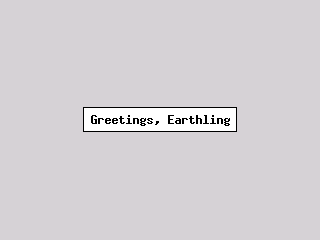
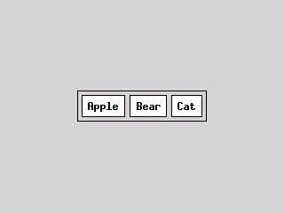
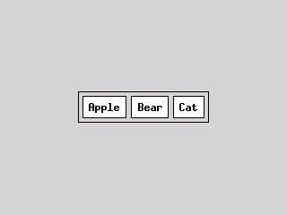
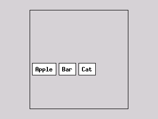

# Layout Guide

This guide explains how to position and size views in `iris-ui` from an application developer's point of view.
Every app is a tree of `View` nodes managed by a `Scene`. You build the tree by calling
`scene.add_view_to_root(view)` or `scene.add_view_to_parent(view, &parent_id)`.
Once the scene is created you must call `layout_scene` to recursively layout
everything in the tree by calling the `layout` method of each view. 
Once laid out you must call `draw_scene` to draw the scene to the screen.  

Before diving into how each of these phases works, let's look at some examples.

## Examples

### Create a Scene with one button in it.

The code below will create a scene with just the button in it. 

```rust
let mut scene = Scene::new_with_bounds(Bounds::new(0, 0, 320, 240));
let button_id = ViewId::new("ok");
let button = make_button(&button_id, "Greetings, Earthling");
scene.add_view_to_root(button);
```

It looks like: *image*



### Create a toolbar with several buttons and a border.

```rust
let mut scene = Scene::new_with_bounds(Bounds::new(0, 0, 320, 240));
let toolbar_id = ViewId::new("toolbar");
let toolbar = make_panel(&toolbar_id)
    .with_layout(Some(layout_hbox))
    .with_state(Some(Box::new(PanelState {
        gap: 5,
        border_visible: true,
        padding: Insets::new_same(5),
    })))
;
scene.add_view_to_root(toolbar);

let button1_id = ViewId::new("button1");
let button1 = make_button(&button1_id, "Apple");
scene.add_view_to_parent(button1, &toolbar_id);

let button2_id = ViewId::new("button2");
let button2 = make_button(&button2_id, "Bear");
scene.add_view_to_parent(button2, &toolbar_id);

let button3_id = ViewId::new("button3");
let button3 = make_button(&button3_id, "Cat");
scene.add_view_to_parent(button3, &toolbar_id);

```

It looks like:



Creating variables for every component's ID and view is annoying, especially if
you don't need to reference them again. Instead you can use them inline like
this:

```rust
let mut scene = Scene::new_with_bounds(Bounds::new(0, 0, 320, 240));
let toolbar_id = ViewId::new("toolbar");

scene.add_view_to_root(
    make_panel(&toolbar_id)
    .with_layout(Some(layout_hbox))
    .with_state(Some(Box::new(PanelState {
        gap: 5,
        border_visible: true,
        padding: Insets::new_same(5),
    })))
    );

scene.add_view_to_parent(make_button(&ViewId::new("button1"), "Apple"), &toolbar_id);
scene.add_view_to_parent(make_button(&ViewId::new("button2"), "Bear"), &toolbar_id);
scene.add_view_to_parent(make_button(&ViewId::new("button3"), "Cat"), &toolbar_id);
```

It still looks like: 




### Centered panel

Now let's make a panel which is centered on the screen but doesn't just
shrink to the size of it's children. We want it to have a fixed width.

```rust

let mut scene = Scene::new_with_bounds(Bounds::new(0, 0, 320, 240));
let toolbar_id = ViewId::new("toolbar");

scene.add_view_to_root(
    make_panel(&toolbar_id)
    .with_state(Some(Box::new(PanelState {
        gap: 5,
        border_visible: true,
        padding: Insets::new_same(5),
    })))
    .with_layout(Some(layout_hbox))
    .with_h_align(Align::Center)
    .with_v_align(Align::Center)
    .with_h_flex(Flex::Fixed)
    .with_v_flex(Flex::Fixed)
    .with_bounds(Bounds::new(0,0,200,200))
);

scene.add_view_to_parent(make_button(&ViewId::new("button1"), "Apple"), &toolbar_id);
scene.add_view_to_parent(make_button(&ViewId::new("button2"), "Bar"), &toolbar_id);
scene.add_view_to_parent(make_button(&ViewId::new("button3"), "Cat"), &toolbar_id);

```
It looks like:




## Concepts

These are the major concepts you need to understand to build an application with Iris.

### The scene tree


```rust
let mut scene = Scene::new_with_bounds(Bounds::new(0, 0, 320, 240));

let panel_id = ViewId::new("panel");
let panel = make_panel(&panel_id).with_layout(Some(layout_vbox));
scene.add_view_to_root(panel);

let button = make_button(&ViewId::new("ok"), "OK");
scene.add_view_to_parent(button, &panel_id);
```

The root view is created automatically; it fills the scene bounds and lays out its direct
children with `layout_root_panel`, which passes each child the full scene size as available space.

### The layout pass

Call `layout_scene(&mut scene, &theme)` once after building the tree (and again after any
structural change). It walks the tree top-down, invoking each view's `layout` function with a
`LayoutEvent` that carries:

- **`pass.target`** — the `ViewId` being laid out
- **`pass.space`** — the `Size` the parent is offering this view
- **`pass.scene`** — mutable access to the whole scene (to read/write view bounds)
- **`pass.theme`** — the active theme (used for font metrics)

A layout function is responsible for:
1. Setting its own `bounds.size` (based on `pass.space` and its own flex rules).
2. Calling `pass.layout_child(kid, available_space)` for each child, which recursively
   invokes that child's layout function.
3. Setting each child's `bounds.position`.

---

## View fields that affect layout

| Field     | Type                 | Default         | Meaning                                          |
|-----------|----------------------|-----------------|--------------------------------------------------|
| `h_flex`  | `Flex`               | `Shrink`        | Grow, fixed, or shrink horizontally.             |
| `v_flex`  | `Flex`               | `Shrink`        | Grow, fixed, or shrink vertically.               |
| `h_align` | `Align`              | `Center`        | horizontal alignment of self.                    |
| `v_align` | `Align`              | `Center`        | vertical alignment of self.                      |
| `bounds`  | `Bounds`             | `(0,0,100,100)` | Current position and size (set by layout)        |
| `layout`  | `Option<LayoutFn>`   | `None`          | An optional function to layout self and children |

Use the builder methods on `View` to set these fluently:
```rust
view.with_flex(Grow, Shrink)
    .with_h_align(Align::Start)
```

### Flex

```
Flex::Shrink  — size to fit content; ignore the offered space on that axis
Flex::Grow    — expand to fill the offered space on that axis
Flex::Fixed   — keep the bounds.size that was set before layout ran
```

A button (`make_button`) defaults to `Shrink` on both axes — it sizes itself to its label.
A panel containing other views usually sets at least one axis to `Grow` so it fills the
available area.

### Align

Controls where a view is placed within the parent.

```
Align::Start   — flush with the leading edge (left for h_align, top for v_align)
Align::Center  — centred in the slot (default)
Align::End     — flush with the trailing edge (right / bottom)
```
---

## Container panels

Most layout functions require the view to carry a `PanelState` in its `state` field.
`make_panel` creates a view with this state pre-attached:

```rust
pub struct PanelState {
    pub padding: Insets,  // space between border and children
    pub gap: i32,         // space between consecutive children
    pub border_visible: bool, // if the border should be drawn
}
```

Use `with_state` to customise it:

```rust
let panel = make_panel(&ViewId::new("toolbar"))
    .with_layout(Some(layout_hbox))
    .with_flex(Grow, Shrink)
    .with_state(Some(Box::new(PanelState {
        padding: Insets::new_same(4),
        gap: 4,
        border_visible: false,
    })));
```

---

## Layout functions

### `layout_vbox` — vertical stack

The layout_vbox function.
Children are stacked top-to-bottom. `Shrink` children are laid out first (natural size);
`Grow` children share the remaining vertical space equally.

```
┌──────────────────────────┐
│  padding.top             │
│  ┌────────────────────┐  │
│  │  Shrink child      │  │
│  └────────────────────┘  │
│  gap                     │
│  ┌────────────────────┐  │
│  │  Grow child        │  │ ← fills leftover height
│  └────────────────────┘  │
│  gap                     │
│  ┌────────────────────┐  │
│  │  Shrink child      │  │
│  └────────────────────┘  │
│  padding.bottom          │
└──────────────────────────┘
```

Each child's `h_align` determines its horizontal position within `(available_width - child_width)`:
- `Start` — at `padding.left`
- `Center` — centred between padded edges
- `End` — at `available_width - child_width + padding.left`

**Parent sizing:**
- `h_flex = Grow` → width fills `space.w`
- `h_flex = Shrink` → width shrinks to the widest child + padding
- `h_flex = Fixed` → width is kept as-is
- `v_flex = Grow` → height fills `space.h`
- `v_flex = Fixed` → height is kept as-is

**Example:**
```rust
let col = make_panel(&ViewId::new("col"))
    .with_layout(Some(layout_vbox))
    .with_flex(Grow, Grow)
    .with_state(Some(Box::new(PanelState {
        padding: Insets::new_same(8),
        gap: 4,
        border_visible: false,
    })));
scene.add_view_to_root(col);

// Shrink: sizes to label text
scene.add_view_to_parent(make_label(&ViewId::new("lbl"), "Name"), &col.name);

// Grow: fills remaining vertical space
let input = make_text_input(&ViewId::new("inp"), "")
    .with_flex(Grow, Grow);
scene.add_view_to_parent(input, &col.name);
```

---

### `layout_hbox` — horizontal stack

Children are placed left-to-right. `Shrink` children get their natural width; `Grow`
children share the remaining horizontal space equally.

```
┌──────────────────────────────────────────────────┐
│ pad │ Shrink │ gap │  Grow (fills leftover)  │ pad│
└──────────────────────────────────────────────────┘
```

Each child's `v_align` determines its vertical position within the row height.

**Parent sizing:**
- `v_flex = Grow` → height fills `space.h`
- `v_flex = Shrink` → height shrinks to the tallest child + padding
- `h_flex = Grow` → width fills `space.w`
- `h_flex = Shrink` → width equals accumulated child widths + gaps + padding

**Example — toolbar with a label that grows and two fixed buttons:**
```rust
let toolbar = make_panel(&ViewId::new("toolbar"))
    .with_layout(Some(layout_hbox))
    .with_flex(Grow, Shrink)
    .with_state(Some(Box::new(PanelState {
        padding: Insets::new(2, 4, 2, 4),
        gap: 4,
        border_visible: true,
    })));
scene.add_view_to_root(toolbar);

let title = make_label(&ViewId::new("title"), "My App")
    .with_h_flex(Flex::Grow);
scene.add_view_to_parent(title, &toolbar.name);
scene.add_view_to_parent(make_button(&ViewId::new("ok"), "OK"),     &toolbar.name);
scene.add_view_to_parent(make_button(&ViewId::new("cancel"), "Cancel"), &toolbar.name);
```

---

### `layout_std_panel` — free-layout container

Sizes itself according to its flex rules, then passes `(self_size - padding)` to every
child as available space. Children position themselves; `layout_std_panel` does not set
`bounds.position` for them.

Use this when children have a custom layout function that handles their own positioning, or
when you are building a single-child container that should expand to fill an area.

```rust
let card = make_panel(&ViewId::new("card"))
    .with_layout(Some(layout_std_panel))
    .with_flex(Grow, Grow)
    .with_state(Some(Box::new(PanelState {
        padding: Insets::new_same(12),
        ..Default::default()
    })));
```

---

### `layout_grid` — fixed-cell grid

Children are placed into named cells. Each child requires a `LayoutConstraint` registered
on the `GridLayoutState`:

```rust
pub struct LayoutConstraint {
    pub col: usize,
    pub row: usize,
    pub col_span: usize,  // default 1
    pub row_span: usize,  // default 1
}
```

`GridLayoutState` divides the available area evenly: `col_width = available_w / col_count`,
`row_height = available_h / row_count`. Within each cell a child is positioned according to
its `h_align` / `v_align`.

**Example:**
```rust
let mut grid = make_grid_panel(&ViewId::new("grid"))
    .with_flex(Grow, Grow);

if let Some(state) = grid.get_state::<GridLayoutState>() {
    state.col_count = 3;
    state.row_count = 2;
    state.padding = Insets::new_same(4);
    state.constraints.insert(ViewId::new("label"), LayoutConstraint {
        col: 0, row: 0, col_span: 1, row_span: 1,
    });
    state.constraints.insert(ViewId::new("value"), LayoutConstraint {
        col: 1, row: 0, col_span: 2, row_span: 1,
    });
}
scene.add_view_to_root(grid);
scene.add_view_to_parent(make_label(&ViewId::new("label"), "Score:"), &grid.name);
scene.add_view_to_parent(make_label(&ViewId::new("value"), "0"),      &grid.name);
```

---

### `layout_tabbed_panel` — tabbed view

`make_tabbed_panel` creates a container that shows one content panel at a time, selected
by a built-in toggle-group tab bar at the top.

1. Call `make_tabbed_panel` with the tab labels and the initial selected index.
2. Obtain the `LayoutPanelState` and call `register_panel(tab_name, &content_id)` for
   each content view.
3. Add each content view as a child of the tabbed panel.

```rust
let tabs_id = ViewId::new("tabs");
let tabbed = make_tabbed_panel(&tabs_id, vec!["Overview", "Settings"], 0, &mut scene)
    .with_flex(Grow, Grow);

// Register content panels
if let Some(state) = tabbed.get_state::<LayoutPanelState>() {
    state.register_panel("Overview", &ViewId::new("overview"));
    state.register_panel("Settings", &ViewId::new("settings"));
}
scene.add_view_to_root(tabbed);

// Add content panels as children of the tabbed panel
let overview = make_panel(&ViewId::new("overview"))
    .with_layout(Some(layout_vbox))
    .with_flex(Grow, Grow);
scene.add_view_to_parent(overview, &tabs_id);

let settings = make_panel(&ViewId::new("settings"))
    .with_layout(Some(layout_std_panel))
    .with_flex(Grow, Grow)
    .with_visible(false);   // hidden initially
scene.add_view_to_parent(settings, &tabs_id);
```

The input handler on the tab bar automatically shows the selected panel and hides the rest.

---

## Composing layouts

Layouts can be nested freely. A common pattern is an outer `layout_vbox` with a fixed-height
toolbar at the top and a `Grow` content area below:

```rust
// Root fills the screen
let root = make_panel(&ViewId::new("root"))
    .with_layout(Some(layout_vbox))
    .with_flex(Grow, Grow);
scene.add_view_to_root(root);

// Fixed-height toolbar (Shrink vertically)
let toolbar = make_panel(&ViewId::new("toolbar"))
    .with_layout(Some(layout_hbox))
    .with_flex(Grow, Shrink);
scene.add_view_to_parent(toolbar, &root.name);

// Content area fills remaining height
let content = make_panel(&ViewId::new("content"))
    .with_layout(Some(layout_std_panel))
    .with_flex(Grow, Grow);
scene.add_view_to_parent(content, &root.name);
```

---

## Custom layout functions

A layout function has type `fn(pass: &mut LayoutEvent)`. It reads `pass.target` to find
its own view, computes sizes, and calls `pass.layout_child` for each child.

```rust
fn layout_center_single(pass: &mut LayoutEvent) {
    // 1. Size self to fill available space.
    if let Some(view) = pass.scene.get_view_mut(&pass.target) {
        view.bounds.size = pass.space;
    }

    // 2. Get children and lay them out.
    let kids = pass.scene.get_children_ids(&pass.target).to_vec();
    for kid in &kids {
        pass.layout_child(kid, pass.space);
    }

    // 3. Center each child within self.
    let self_bounds = pass.scene.get_view_bounds(&pass.target).unwrap_or_default();
    for kid in &kids {
        if let Some(child) = pass.scene.get_view_mut(kid) {
            child.bounds.position.x = (self_bounds.size.w - child.bounds.size.w) / 2;
            child.bounds.position.y = (self_bounds.size.h - child.bounds.size.h) / 2;
        }
    }
}
```

Attach it to any view the same way as a built-in:

```rust
let panel = make_panel(&ViewId::new("centered"))
    .with_layout(Some(layout_center_single))
    .with_flex(Grow, Grow);
```

**Rules for layout functions:**
- `pass.space` is the size *offered* by the parent — your function decides whether to use it.
- Call `pass.layout_child` before reading `child.bounds.size`; the child sets its own size.
- Avoid holding a borrow on `pass.scene` while calling `pass.layout_child`. Collect child
  IDs into an owned `Vec` first (e.g. `get_children_ids(...).to_vec()`).

---

## Running the layout pass

Call `layout_scene` once after building or modifying the tree:

```rust
layout_scene(&mut scene, &theme);
```

After that, draw with:

```rust
draw_scene(&mut scene, &mut ctx, &theme);
```

For partial redraws (e.g. after a button tap), call `scene.mark_dirty_view(&view_id)` to
record which region changed. `draw_scene` will skip view subtrees whose bounds do not
intersect the dirty region.
